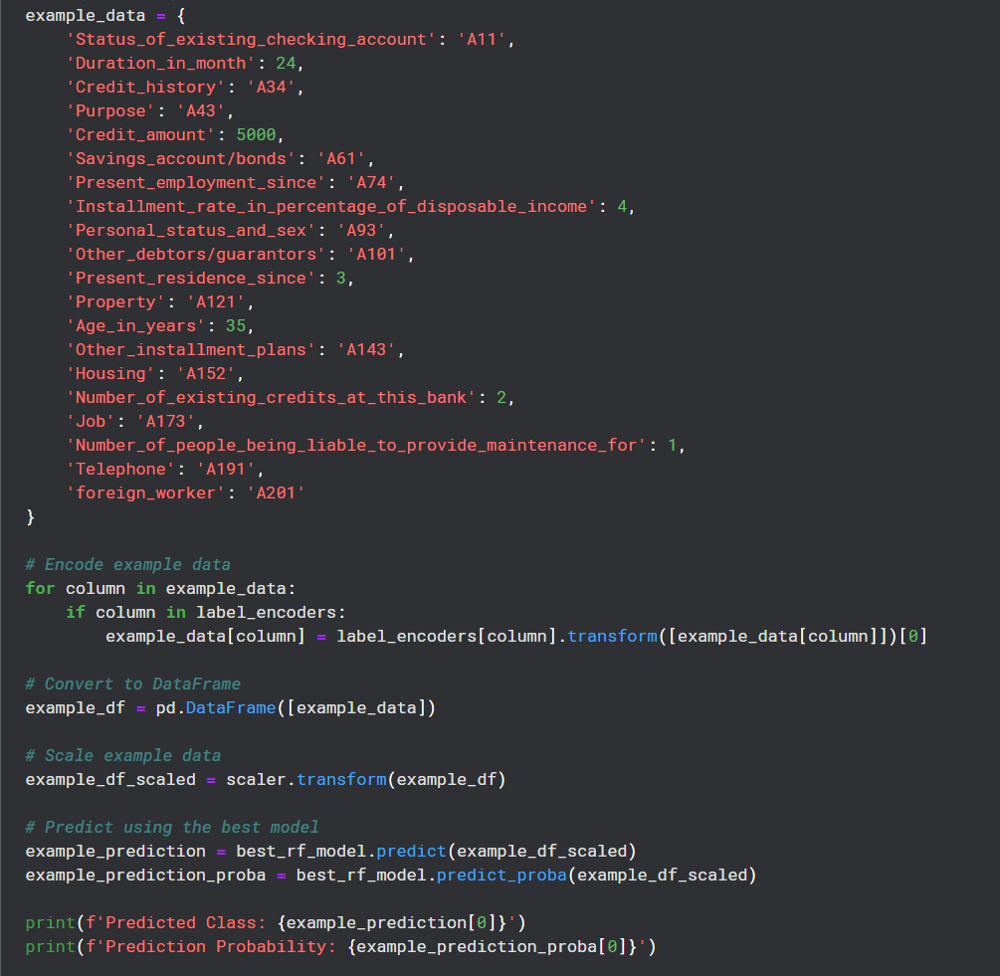
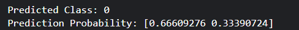

Project: Predicting Creditworthiness Using Random Forest
Introduction

This project aims to predict the creditworthiness of individuals using the Statlog (German Credit Data) dataset. The dataset contains various financial attributes of individuals and a target variable indicating good or bad credit risk. The project employs a Random Forest classifier, a powerful ensemble learning method, to build the prediction model.
1. Data Loading and Initial Exploration

The first step involves loading the dataset from the UCI Machine Learning Repository. The dataset consists of 1,000 instances with 20 features and a target variable indicating good or bad credit risk.

Initial exploration includes checking the structure of the dataset, understanding the types of features (categorical or numerical), and identifying any missing values. Summary statistics and visualizations such as count plots for the target variable and correlation heatmaps for numerical features help in understanding the data distribution and relationships.
2. Data Preprocessing

Data preprocessing is crucial to ensure the model can handle the input data effectively. The steps include:

    Encoding Categorical Variables: The dataset contains several categorical variables that need to be converted into numerical format. Label Encoding is used to transform these categorical features into numerical values.
    Feature Scaling: Numerical features are scaled using StandardScaler to standardize the features by removing the mean and scaling to unit variance. This ensures that the features contribute equally to the model.

3. Splitting the Data

The dataset is split into training and test sets. The training set is used to train the model, while the test set is used to evaluate the model's performance. An 80-20 split is commonly used, where 80% of the data is used for training and 20% for testing.
4. Model Building and Hyperparameter Tuning

A Random Forest classifier is chosen for its robustness and ability to handle a large number of features. The model building process includes:

    Hyperparameter Tuning: GridSearchCV is used to perform hyperparameter tuning. Various combinations of hyperparameters such as the number of trees (n_estimators), maximum depth of the trees (max_depth), and the criterion for splitting (criterion) are tested to find the best model.
    Training the Model: The Random Forest model is trained using the training data. The best combination of hyperparameters is selected based on cross-validation performance.

5. Model Evaluation

Model evaluation involves assessing the performance of the trained model on the test set using various metrics:

    Accuracy: The proportion of correctly predicted instances out of the total instances.
    Precision: The proportion of true positive predictions out of the total positive predictions.
    Recall: The proportion of true positive predictions out of the total actual positives.
    F1 Score: The harmonic mean of precision and recall, providing a single measure of model performance.
    Confusion Matrix: A matrix showing the counts of true positive, true negative, false positive, and false negative predictions.

Visualizations such as confusion matrix heatmaps and ROC curves (Receiver Operating Characteristic) are used to further assess model performance.
6. Feature Importance

Random Forest provides an inherent measure of feature importance based on how useful they are in predicting the target variable. Feature importance scores are visualized to understand which features contribute most to the model’s predictions. This helps in interpreting the model and understanding the underlying patterns in the data.
7. Predicting on New Data

To make predictions on new data, the following steps are taken:

    Encoding: The new data point is encoded using the same label encoders used during training.
    Scaling: The new data point is scaled using the trained scaler.
    Prediction: The processed data point is fed into the trained Random Forest model to predict the creditworthiness and the probability of the prediction.

Conclusion

This project demonstrates the process of building a predictive model for creditworthiness using the Statlog (German Credit Data) dataset. From data preprocessing to model evaluation, each step ensures that the model is robust and capable of making accurate predictions. The use of Random Forest, a powerful ensemble method, enhances the model’s performance and provides insights into feature importance. This project can be extended to include more complex models or additional features for even better performance.

Outcomes

Feature Importance: The analysis revealed that certain features, such as the 'Status of existing checking account' and 'Credit history,' were significant predictors of creditworthiness, providing valuable insights into the factors influencing credit risk.
Model Interpretability: The project highlighted the importance of data preprocessing, including categorical encoding and feature scaling, which are critical for the successful implementation and interpretability of the Random Forest model in real-world applications.
